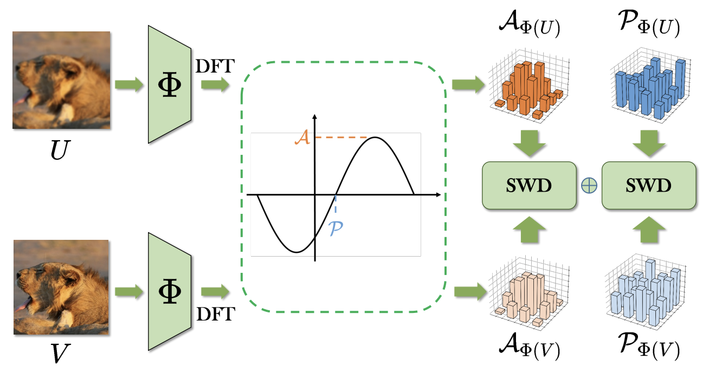
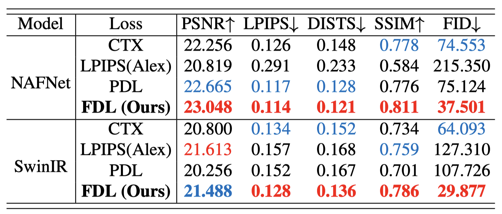
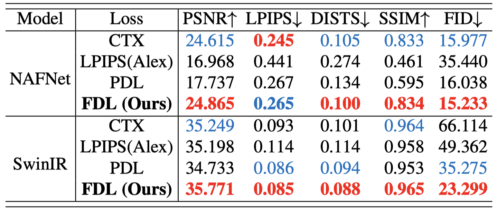
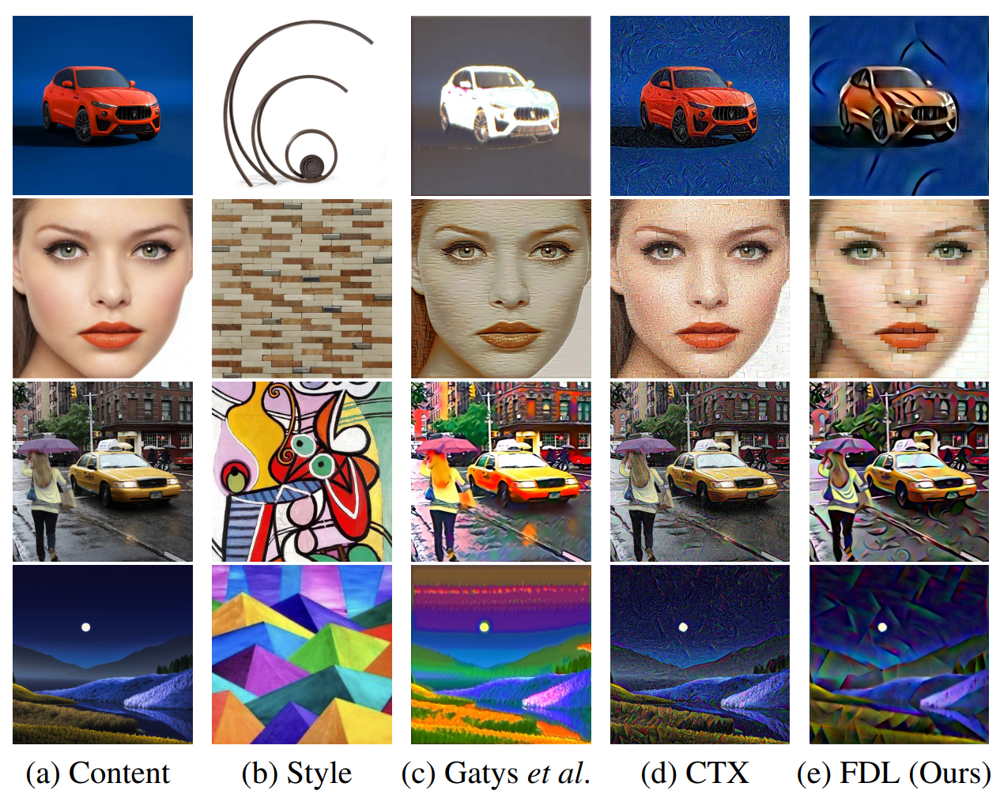

## Misalignment-Robust Frequency Distribution Loss for Image Transformation

#### The IEEE/CVF Conference on Computer Vision and Pattern Recognition (CVPR), 2024

[Zhangkai Ni](https://eezkni.github.io/)<sup>1</sup>, [Juncheng Wu](https://scholar.google.com/citations?user=RSn2gykAAAAJ&hl=en&oi=sra)<sup>1</sup>, [Zian Wang](https://scholar.google.com/citations?user=Mi6YUBoAAAAJ&hl=en&oi=sra)<sup>1</sup>, [Wenhan Yang](https://flyywh.github.io/)<sup>2</sup>, [Hanli Wang](https://mic.tongji.edu.cn/51/91/c9778a86417/page.htm)<sup>1</sup>, [Lin Ma](https://forestlinma.com/)<sup>3</sup>

<sup>1</sup>Tongji University, <sup>2</sup>Pengcheng Laboratory, <sup>3</sup>Meituan

This repository provides the official PyTorch implementation for the paper “Misalignment-Robust Frequency Distribution Loss for Image Transformation”, CVPR-2024. [Paper](https://arxiv.org/abs/2402.18192)

<!--  -->
<div align="center">  </div>
<!-- <div align="center">  </div> -->


## About FDL

This paper aims to address a common challenge in deep learning-based image transformation methods, such as image enhancement and super-resolution, which heavily rely on precisely aligned paired datasets with pixel-level alignments. However, creating precisely aligned paired images presents significant challenges and hinders the advancement of methods trained on such data. To overcome this challenge, this paper introduces a novel and simple Frequency Distribution Loss (FDL) for computing distribution distance within the frequency domain. Specifically, we transform image features into the frequency domain using Discrete Fourier Transformation (DFT). Subsequently, frequency components (amplitude and phase) are processed separately to form the FDL loss function. Our method is empirically proven effective as a training constraint due to the thoughtful utilization of global information in the frequency domain. Extensive experimental evaluations, focusing on image enhancement and super-resolution tasks, demonstrate that FDL outperforms existing misalignment-robust loss functions. Furthermore, we explore the potential of our FDL for image style transfer that relies solely on completely misaligned data.

**TL;DR:** We propose a novel Frequency Distribution Loss (FDL) for image transformation models trained with misaligned data, opening up new avenues for addressing the broad issue of misalignment in image transformation tasks.


## Experimental Results
### 1. Image Enhancement
The quantitative comparison of image enhancement on the DPED dataset demonstrates the superiority of our proposed FDL over all compared loss functions across various evaluation criteria.
<div align=center></div>
<!-- <div align=center></div> -->
<!--  -->


### 2. Super Resolution
We compare our proposed FDL against state-of-the-art loss functions in real-world single image super resolution.
<!-- <div align=center></div> -->
<!--  -->
<div align=center></div>


### 3. Style Transfer
Our proposed FDL is also capable of handling style transfer, since the use of distribution distance measurement in the frequency domain.
<!-- <div align=center></div> -->
<div align=center></div>


## Quick Start
### Installation:

`pip install fdl-pytorch`


### Requirements:
- Python>=3.6
- Pytorch>=1.0


### Usage:
```python
from FDL_pytorch import FDL_loss
fdl_loss = FDL_loss()
# X: (N,C,H,W) 
# Y: (N,C,H,W) 
loss_value = fdl_loss(X, Y)
loss_value.backward()
```

## Citation
If you find our work useful, please cite it as

```
@inproceedings{ni2024misalignment,
  title={Misalignment-robust frequency distribution loss for image transformation},
  author={Ni, Zhangkai and Wu, Juncheng and Wang, Zian and Yang, Wenhan and Wang, Hanli and Ma, Lin},
  booktitle={Proceedings of the IEEE/CVF Conference on Computer Vision and Pattern Recognition},
  pages={2910--2919},
  year={2024}
}
```


## Contact
Thanks for your attention! If you have any suggestion or question, feel free to leave a message here or contact Dr. Zhangkai Ni (eezkni@gmail.com) or Juncheng Wu (jwu418@ucsc.edu).


## License
[MIT License](https://opensource.org/licenses/MIT)


